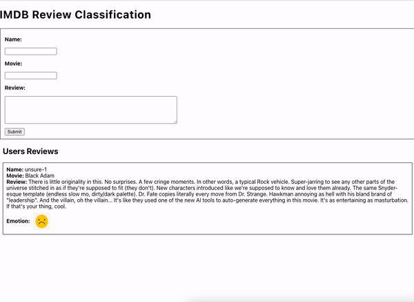

# APP Reviews ML

This project was developed to be a front-end interface for the api-review-ml project. In this UI, the user can inform movie reviews and after registration it will be returned if the review is positive or negative.
<br>
<br>

## Pre-requisites

This project was developed using react-js

<br>

## Execute project

```
   npm init 
```

```
   npm start 
```

<br>
<br>

## UI



<br>

## API Review

For more information about api [check here](https://github.com/andreluiz1987/api-review-ml/)

<br>
<br>

## More information

For more information visit
post [Text Classification Reviews IMDB — Elasticsearch](https://medium.com/@andre.luiz1987/text-classification-reviews-imdb-elasticsearch-e4860e853d84)
